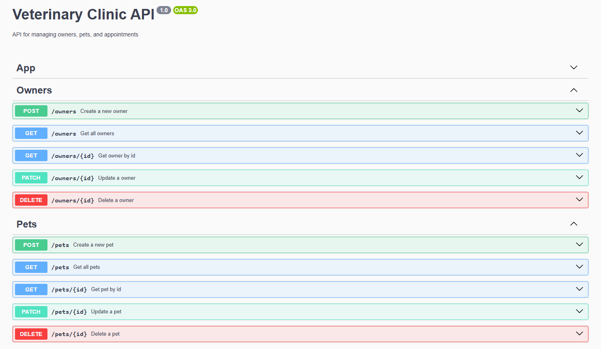

# Vet Clinic Backend Service

Serviço backend para gerenciamento dos recursos Pets, Owners e Appointments de uma clínica veterinária.

---

## Tecnologias

- NestJS (TypeScript)
- REST para Pets e Owners
- GraphQL para Appointments
- PostgreSQL via TypeORM

---

## Estrutura

- **Owners:** recurso REST para donos dos pets
- **Pets:** recurso REST para os pets
- **Appointments:** recurso GraphQL para agendamentos

---

## Configuração

### Banco de dados

Configure o banco PostgreSQL com as credenciais corretas no arquivo `app.module.ts` (ou via variáveis de ambiente):

```ts
TypeOrmModule.forRoot({
  type: 'postgres',
  host: 'localhost',
  port: 5432,
  username: 'postgres',
  password: 'postgres',
  database: 'vet_clinic',
  entities: [Owner, Pet, Appointment],
  synchronize: true,
});
```

---

## Rodando o serviço

Instale dependências:

```bash
npm install
```

Inicie em modo de desenvolvimento:

```bash
npm run start:dev
```

---

## Endpoints REST

- **Owners:** CRUD via REST padrão (ex: `GET /owners`, `POST /owners`, etc.)
- **Pets:** CRUD via REST padrão (ex: `GET /pets`, `POST /pets`, etc.)

_Documentação Swagger pode ser adicionada para esses endpoints REST_


---

## GraphQL (Appointments)

O serviço expõe um endpoint GraphQL para gerenciar os agendamentos.

### Endpoint GraphQL

```
http://localhost:3000/graphql
```

### Exemplos de consultas

Consulta todos os agendamentos:

```graphql
query {
  appointments {
    id
    date
    status
    petId
    ownerId
  }
}
```

Criar um novo agendamento:

```graphql
mutation {
  createAppointment(
    createAppointmentInput: {
      date: "2025-07-01T10:00:00.000Z"
      status: "scheduled"
      petId: 1
      ownerId: 2
    }
  ) {
    id
    date
    status
  }
}
```

---

## Entidades principais

- **Owner:** id, name, email, phone
- **Pet:** id, name, species, breed, age, ownerId
- **Appointment:** id, date, status, petId, ownerId

---

## Observações

- Os relacionamentos `pet` e `owner` no Appointment estão representados apenas pelos IDs para simplicidade.
- REST e GraphQL coexistem no mesmo serviço NestJS.

---

## Contato

Rickson Rocha  
ricksonrocha0@gmail.com  
https://github.com/RicksonRocha
